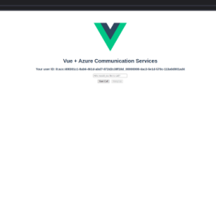
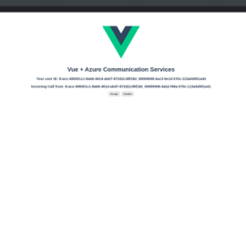
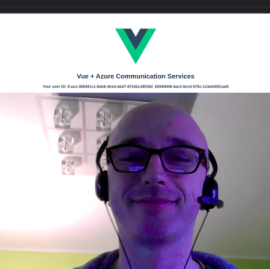

# Azure Communication Service + Vue + Nginx
This stack consists of components, for Your video calling, vue based web application. With express.js for API endpoint and security, vue with vuex for user interface and nginx to separate the services it is ready for development. There is no database used, so You can choose one on Your own, and docker-compose lets You start right away. Treat it as a start point for building Your own application.

**Stack description**

* express.js - serves as the endpoint for creating Azure communication service users, as well as a secure way to pass the token to the application. It can also be used for Your future database access layer.
* Vue with vuex - for Your user interface.
* Nginx as the proxy for the services.


  

## Requirements
Docker and docker-compose, installed on Your local machine.
Access to [Azure Communication Services](https://azure.microsoft.com/services/communication-services/ "Azure Communication Services")


## Getting started
Clone the repository.
Copy `.env.example` file and rename it to `.env` file.
Change `TOKEN_SECRET`. Add missing `COMMUNICATION_SERVICES_CONNECTION_STRING` (learn more about it [here](https://docs.microsoft.com/en-us/azure/communication-services/quickstarts/create-communication-resource?tabs=linux&pivots=platform-azp#access-your-connection-strings-and-service-endpoints))

Navigate to the project folder and type in Your terminal:
```sh
    docker-compose up -d
```

## Development
Remember to check the `server.js` file in `endpoint` folder, and `store.js` in the `application\src`. Those commands might be useful during the development:
```sh
    docker-compose exec application npm run build
    docker-compose build --no-cache endpoint
    docker-compose build --no-cache application
    docker-compose build --no-cache nginx
```